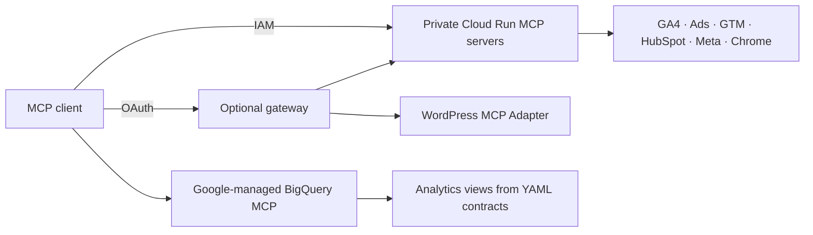

# Growth Web MCP

[English](README.md) · [Português (Brasil)](README.pt-BR.md) · **Español**

**Conecta tu asistente de IA con todo el embudo de marketing.**

Servidores Model Context Protocol (MCP) alojados por ti en Google Cloud: reúne tráfico, campañas, seguimiento, formularios y CRM en un solo flujo de trabajo.

[](LICENSE)
[](https://github.com/eumoitinho/growth-web-mcp/stargazers)
[](https://github.com/eumoitinho/growth-web-mcp/issues)

[](servers/ga4)
[](servers/google-ads)
[](servers/gtm)
[](servers/hubspot)
[](servers/meta)
[](bigquery)
[](wordpress)
[](servers/site-browser)

## ¿Por qué usarlo?

- Sigue el recorrido desde la campaña y la landing page hasta la conversión y el ciclo de vida en el CRM.
- Audita eventos de GA4, etiquetas de GTM, atribución y enrutamiento de formularios de HubSpot.
- Consulta una capa consistente en BigQuery construida con contratos YAML versionados.
- Empieza con servicios de lectura; habilita servicios separados de escritura para GTM y HubSpot cuando los necesites.

## Integraciones

| Integración | Cobertura | Implementación |
|---|---|---|
| Google Analytics 4 | Informes, propiedades y configuración de eventos | Google Analytics MCP + herramientas Admin adicionales |
| Google Ads | Consultas de campañas y conversiones | Wrapper de Google Ads MCP |
| Google Tag Manager | Contenedores, etiquetas y activadores; escritura opcional | Core de Stape + política por acción |
| HubSpot | CRM, formularios, envíos y pipelines; escritura opcional | HubSpot MCP + herramientas adicionales |
| Meta Ads | Insights, destinos de anuncios, píxeles y metadatos de Lead Ads | Servidor de lectura de Marketing API |
| BigQuery | Vistas de eventos, sesiones, conversiones y embudo | MCP gestionado por Google + plantillas SQL |
| WordPress | Plugins, fragmentos de seguimiento, formularios y páginas | MCP Adapter + abilities de lectura |
| Chrome DevTools | Inspección del navegador, red y rendimiento | Navegador headless mediante MCP |

## Cómo funciona

Los servicios privados de Cloud Run usan Google IAM. Un gateway OAuth opcional expone los servicios de lectura mediante una única URL de conector. WordPress se instala por separado; BigQuery usa el endpoint MCP gestionado por Google.



## Inicio rápido

Para desplegar en la nube: proyecto de Google Cloud con facturación activa, `gcloud` y `bq` autenticados, Terraform ≥ 1.6, Python ≥ 3.11 y acceso a las integraciones configuradas. El bootstrap completo solicita credenciales de HubSpot, Google Ads y Meta. Las vistas requieren la exportación de GA4 a BigQuery. Docker solo es necesario para contenedores locales; Node.js ≥ 22 para desarrollar los servidores TypeScript.

```bash
git clone https://github.com/eumoitinho/growth-web-mcp.git
cd growth-web-mcp
python3 -m venv .venv
source .venv/bin/activate
python -m pip install PyYAML
cp infra/terraform/terraform.tfvars.example infra/terraform/terraform.tfvars
```

Edita `infra/terraform/terraform.tfvars` y `config/*.yaml`: configura proyecto, región, dominios, IDs de cuentas y miembros IAM. Mantén la región consistente. Todos los valores incluidos son ejemplos. El bootstrap crea recursos facturables en la nube y aplica Terraform automáticamente.

```bash
export PROJECT_ID="your-gcp-project"
export REGION="southamerica-east1"
gcloud auth login
gcloud config set project "$PROJECT_ID"
scripts/bootstrap.sh
```

Después del despliegue, concede acceso a las cuentas de servicio en los productos siguiendo la [guía de acceso](docs/access-setup.md) (portugués). Después:

```bash
scripts/write-env.sh > .env
set -a; source .env; set +a
scripts/bq-apply.sh
python scripts/smoke_test.py "$GROWTH_MCP_GA4_URL" --id-token
```

WordPress y el gateway OAuth requieren configuración por separado: consulta las guías siguientes. Define `WP_MCP_URL` y `WP_MCP_BASIC_AUTH` localmente si utilizas WordPress; de lo contrario, elimina su entrada del `.mcp.json` local. El cliente MCP debe soportar Streamable HTTP y la autenticación del servicio. La configuración incluida está dirigida a Claude Code.

### Ejecutar GA4 localmente

Configura Application Default Credentials con acceso a tu propiedad GA4 antes de iniciar el contenedor. Guarda las credenciales fuera de este repositorio.

```bash
gcloud auth application-default login
docker build -t growth-ga4 servers/ga4
docker run --rm -p 8080:8080 \
  -e GOOGLE_APPLICATION_CREDENTIALS=/adc.json \
  -v "$HOME/.config/gcloud/application_default_credentials.json:/adc.json:ro" \
  growth-ga4
```

## Documentación

El README de entrada está disponible en tres idiomas. Las guías operativas detalladas y los playbooks del agente están actualmente en portugués; las contribuciones de traducción son bienvenidas.

| Guía | Objetivo |
|---|---|
| [Arquitectura y upstreams](docs/architecture.pt-BR.md) | Servicios, dependencias fijadas y contratos de datos |
| [Configuración de acceso](docs/access-setup.md) | Permisos de productos e IAM |
| [Acceso de escritura](docs/write-access.md) | Identidades y herramientas separadas para lectura/escritura |
| [Gateway OAuth](docs/claude-web-connector.md) | Conectar mediante Google OAuth |
| [WordPress](wordpress/README.md) | Instalar abilities de lectura |
| [BigQuery](bigquery/README.md) | Generar y aplicar vistas analíticas |
| [Playbooks del agente](.claude/skills) | Flujos de auditoría para el agente |
| [Roadmap](docs/roadmap.md) | Trabajo completado y próximos pasos |

## Soporte y contribuciones

Usa [GitHub Issues](https://github.com/eumoitinho/growth-web-mcp/issues/new/choose) para errores reproducibles, sugerencias y preguntas de uso. El soporte es comunitario, sin un plazo de respuesta garantizado. Aceptamos español, inglés y portugués.

Lee [SUPPORT.md](SUPPORT.md), [CONTRIBUTING.md](CONTRIBUTING.md) y el [Código de Conducta](CODE_OF_CONDUCT.md). Reporta vulnerabilidades en privado siguiendo [SECURITY.md](SECURITY.md).

## Estado y licencia

Proyecto en etapa inicial: valida las integraciones en tu entorno antes de usarlas en producción. Mantenido por [eumoitinho](https://github.com/eumoitinho), bajo [Apache-2.0](LICENSE). Los servicios y dependencias de terceros mantienen sus propios términos y licencias. Este proyecto es independiente y no implica respaldo de las plataformas anteriores.

## Historial de estrellas

Si el proyecto te resulta útil, considera darle una estrella. El gráfico lo proporciona Star History y puede tardar en reflejar nuevas estrellas.

[](https://www.star-history.com/#eumoitinho/growth-web-mcp&Date)
