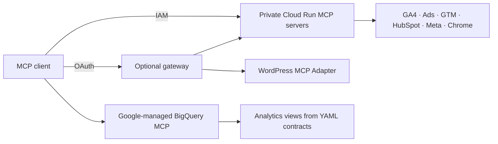

# Growth Web MCP

**English** · [Português (Brasil)](README.pt-BR.md) · [Español](README.es.md)

**Connect your AI assistant to the whole marketing funnel.**

Self-hosted Model Context Protocol (MCP) servers for Google Cloud: bring traffic, campaigns, tracking, forms and CRM data into one workflow.

[](LICENSE)
[](https://github.com/eumoitinho/growth-web-mcp/stargazers)
[](https://github.com/eumoitinho/growth-web-mcp/issues)

[](servers/ga4)
[](servers/google-ads)
[](servers/gtm)
[](servers/hubspot)
[](servers/meta)
[](bigquery)
[](wordpress)
[](servers/site-browser)

## Why use it?

- Trace the journey from campaign and landing page to conversion and CRM lifecycle.
- Audit GA4 events, GTM tags, attribution and HubSpot form routing.
- Query a consistent BigQuery layer built from versioned YAML contracts.
- Start with read-only services; enable separate GTM and HubSpot write services when needed.

## Integrations

| Integration | Coverage | Implementation |
|---|---|---|
| Google Analytics 4 | Reports, properties and event configuration | Google Analytics MCP + additional Admin tools |
| Google Ads | Campaign and conversion queries | Google Ads MCP wrapper |
| Google Tag Manager | Containers, tags and triggers; optional writes | Stape core + action policy |
| HubSpot | CRM, forms, submissions and pipelines; optional writes | HubSpot MCP + additional tools |
| Meta Ads | Insights, ad destinations, pixels and Lead Ads metadata | Read-only Marketing API server |
| BigQuery | Clean events, sessions, conversions and funnel views | Google-managed MCP + SQL templates |
| WordPress | Plugins, tracking snippets, forms and pages | MCP Adapter + read-only abilities |
| Chrome DevTools | Browser inspection, network and performance | Headless browser via MCP |

## How it fits together

The private Cloud Run services use Google IAM. An optional OAuth gateway exposes the read services through a single connector URL. WordPress is installed separately; BigQuery uses Google’s managed MCP endpoint.



## Quickstart

For cloud deployment: a Google Cloud project with billing enabled, authenticated `gcloud` and `bq`, Terraform ≥ 1.6, Python ≥ 3.11, and access to the integrations you configure. The full bootstrap requests HubSpot, Google Ads and Meta credentials. GA4 BigQuery export is required for the analytics views. Docker is needed only for local containers; Node.js ≥ 22 for TypeScript development.

```bash
git clone https://github.com/eumoitinho/growth-web-mcp.git
cd growth-web-mcp
python3 -m venv .venv
source .venv/bin/activate
python -m pip install PyYAML
cp infra/terraform/terraform.tfvars.example infra/terraform/terraform.tfvars
```

Edit `infra/terraform/terraform.tfvars` and `config/*.yaml`: set your project, region, domains, account IDs and IAM members. Keep the region consistent. All supplied values are examples. The bootstrap creates billable cloud resources and applies Terraform automatically.

```bash
export PROJECT_ID="your-gcp-project"
export REGION="southamerica-east1"
gcloud auth login
gcloud config set project "$PROJECT_ID"
scripts/bootstrap.sh
```

After deployment, grant the service accounts access to your products using the [access guide](docs/access-setup.md) (Portuguese). Then:

```bash
scripts/write-env.sh > .env
set -a; source .env; set +a
scripts/bq-apply.sh
python scripts/smoke_test.py "$GROWTH_MCP_GA4_URL" --id-token
```

WordPress and the OAuth gateway need separate configuration: see the guides below. Set `WP_MCP_URL` and `WP_MCP_BASIC_AUTH` locally if using WordPress; otherwise remove its entry from your local `.mcp.json`. Your MCP client must support Streamable HTTP and the service’s authentication. The supplied configuration targets Claude Code.

### Run GA4 locally

Configure Application Default Credentials with access to your GA4 property before starting the container. Store credentials outside this repository.

```bash
gcloud auth application-default login
docker build -t growth-ga4 servers/ga4
docker run --rm -p 8080:8080 \
  -e GOOGLE_APPLICATION_CREDENTIALS=/adc.json \
  -v "$HOME/.config/gcloud/application_default_credentials.json:/adc.json:ro" \
  growth-ga4
```

## Documentation

The entry README is available in three languages. Detailed operational guides and agent playbooks are currently in Portuguese; translation contributions are welcome.

| Guide | Purpose |
|---|---|
| [Architecture and upstreams](docs/architecture.pt-BR.md) | Services, pinned dependencies and data contracts |
| [Access setup](docs/access-setup.md) | Grant product and IAM permissions |
| [Write access](docs/write-access.md) | Separate read/write identities and tools |
| [OAuth gateway](docs/claude-web-connector.md) | Connect through Google OAuth |
| [WordPress](wordpress/README.md) | Install read-only abilities |
| [BigQuery](bigquery/README.md) | Render and apply analytics views |
| [Agent playbooks](.claude/skills) | Audit workflows for the agent |
| [Roadmap](docs/roadmap.md) | Completed work and future directions |

## Support and contributions

Use [GitHub Issues](https://github.com/eumoitinho/growth-web-mcp/issues/new/choose) for reproducible bugs, feature requests and usage questions. Support is community-based, with no guaranteed response time. English, Portuguese and Spanish are welcome.

Read [SUPPORT.md](SUPPORT.md), [CONTRIBUTING.md](CONTRIBUTING.md) and the [Code of Conduct](CODE_OF_CONDUCT.md). Report vulnerabilities privately following [SECURITY.md](SECURITY.md).

## Status and license

Early-stage project: validate the integrations in your own environment before production use. Maintained by [eumoitinho](https://github.com/eumoitinho), under [Apache-2.0](LICENSE). Third-party services and dependencies retain their own terms and licenses. This is an independent project, not an endorsement by the platforms above.

## Star history

If this project helps you, consider starring it. The chart is provided by Star History and may take time to reflect new stars.

[](https://www.star-history.com/#eumoitinho/growth-web-mcp&Date)
