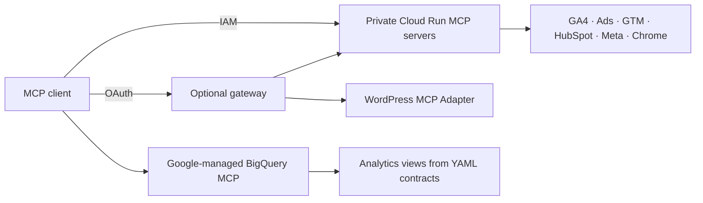

# Growth Web MCP

[English](README.md) · **Português (Brasil)** · [Español](README.es.md)

**Conecte seu assistente de IA a todo o funil de marketing.**

Servidores Model Context Protocol (MCP) hospedados por você no Google Cloud: reúna tráfego, campanhas, tracking, formulários e CRM em um único fluxo de trabalho.

[](LICENSE)
[](https://github.com/eumoitinho/growth-web-mcp/stargazers)
[](https://github.com/eumoitinho/growth-web-mcp/issues)

[](servers/ga4)
[](servers/google-ads)
[](servers/gtm)
[](servers/hubspot)
[](servers/meta)
[](bigquery)
[](wordpress)
[](servers/site-browser)

## Por que usar?

- Acompanhe a jornada da campanha e landing page até a conversão e o ciclo de vida no CRM.
- Audite eventos GA4, tags GTM, atribuição e roteamento de formulários HubSpot.
- Consulte uma camada consistente no BigQuery, construída com contratos YAML versionados.
- Comece com serviços de leitura; habilite serviços separados de escrita para GTM e HubSpot quando necessário.

## Integrações

| Integração | Cobertura | Implementação |
|---|---|---|
| Google Analytics 4 | Relatórios, propriedades e configuração de eventos | Google Analytics MCP + ferramentas Admin adicionais |
| Google Ads | Consultas de campanhas e conversões | Wrapper do Google Ads MCP |
| Google Tag Manager | Containers, tags e triggers; escrita opcional | Core da Stape + política por ação |
| HubSpot | CRM, formulários, submissões e pipelines; escrita opcional | HubSpot MCP + ferramentas adicionais |
| Meta Ads | Insights, destinos de anúncios, pixels e metadados de Lead Ads | Servidor de leitura da Marketing API |
| BigQuery | Views de eventos, sessões, conversões e funil | MCP gerenciado pelo Google + templates SQL |
| WordPress | Plugins, snippets de tracking, formulários e páginas | MCP Adapter + abilities de leitura |
| Chrome DevTools | Inspeção do navegador, rede e performance | Navegador headless via MCP |

## Como funciona

Os serviços privados do Cloud Run usam Google IAM. Um gateway OAuth opcional expõe os serviços de leitura por uma única URL de conector. O WordPress é instalado separadamente; o BigQuery usa o endpoint MCP gerenciado pelo Google.



## Início rápido

Para implantar na nuvem: projeto Google Cloud com faturamento ativo, `gcloud` e `bq` autenticados, Terraform ≥ 1.6, Python ≥ 3.11 e acesso às integrações configuradas. O bootstrap completo solicita credenciais de HubSpot, Google Ads e Meta. As views dependem do export GA4 → BigQuery. Docker só é necessário para containers locais; Node.js ≥ 22 para desenvolver os servidores TypeScript.

```bash
git clone https://github.com/eumoitinho/growth-web-mcp.git
cd growth-web-mcp
python3 -m venv .venv
source .venv/bin/activate
python -m pip install PyYAML
cp infra/terraform/terraform.tfvars.example infra/terraform/terraform.tfvars
```

Edite `infra/terraform/terraform.tfvars` e `config/*.yaml`: informe projeto, região, domínios, IDs das contas e membros IAM. Mantenha a região consistente. Todos os valores fornecidos são exemplos. O bootstrap cria recursos cobrados na nuvem e aplica o Terraform automaticamente.

```bash
export PROJECT_ID="your-gcp-project"
export REGION="southamerica-east1"
gcloud auth login
gcloud config set project "$PROJECT_ID"
scripts/bootstrap.sh
```

Após a implantação, conceda acesso às service accounts nos produtos seguindo o [guia de acesso](docs/access-setup.md). Depois:

```bash
scripts/write-env.sh > .env
set -a; source .env; set +a
scripts/bq-apply.sh
python scripts/smoke_test.py "$GROWTH_MCP_GA4_URL" --id-token
```

WordPress e gateway OAuth exigem configuração separada: veja os guias abaixo. Defina `WP_MCP_URL` e `WP_MCP_BASIC_AUTH` localmente ao usar WordPress; caso contrário, remova sua entrada do `.mcp.json` local. O cliente MCP precisa suportar Streamable HTTP e a autenticação do serviço. A configuração fornecida é destinada ao Claude Code.

### Executar GA4 localmente

Configure Application Default Credentials com acesso à propriedade GA4 antes de iniciar o container. Guarde as credenciais fora deste repositório.

```bash
gcloud auth application-default login
docker build -t growth-ga4 servers/ga4
docker run --rm -p 8080:8080 \
  -e GOOGLE_APPLICATION_CREDENTIALS=/adc.json \
  -v "$HOME/.config/gcloud/application_default_credentials.json:/adc.json:ro" \
  growth-ga4
```

## Documentação

O README de entrada está disponível em três idiomas. Os guias operacionais detalhados e os playbooks do agente estão atualmente em português; contribuições de tradução são bem-vindas.

| Guia | Objetivo |
|---|---|
| [Arquitetura e upstreams](docs/architecture.pt-BR.md) | Serviços, dependências fixadas e contratos de dados |
| [Configuração de acesso](docs/access-setup.md) | Permissões nos produtos e no IAM |
| [Acesso de escrita](docs/write-access.md) | Identidades e ferramentas separadas para leitura/escrita |
| [Gateway OAuth](docs/claude-web-connector.md) | Conectar com Google OAuth |
| [WordPress](wordpress/README.md) | Instalar abilities de leitura |
| [BigQuery](bigquery/README.md) | Gerar e aplicar views analíticas |
| [Playbooks do agente](.claude/skills) | Fluxos de auditoria para o agente |
| [Roadmap](docs/roadmap.md) | Entregas concluídas e próximos passos |

## Suporte e contribuições

Use [GitHub Issues](https://github.com/eumoitinho/growth-web-mcp/issues/new/choose) para bugs reproduzíveis, sugestões e dúvidas de uso. O suporte é comunitário, sem prazo de resposta garantido. Português, inglês e espanhol são bem-vindos.

Leia [SUPPORT.md](SUPPORT.md), [CONTRIBUTING.md](CONTRIBUTING.md) e o [Código de Conduta](CODE_OF_CONDUCT.md). Relate vulnerabilidades em privado conforme [SECURITY.md](SECURITY.md).

## Status e licença

Projeto em estágio inicial: valide as integrações no seu ambiente antes de usar em produção. Mantido por [eumoitinho](https://github.com/eumoitinho), sob [Apache-2.0](LICENSE). Serviços e dependências de terceiros mantêm seus próprios termos e licenças. Este projeto é independente e não representa endosso das plataformas acima.

## Validação de jornadas

Execute contratos dos serviços, jornadas de navegador e reconciliação GA4/CRM. Veja o [guia de validação](docs/validation.md) para testes locais, configuração de homologação, relatórios e limites atuais.

## Histórico de estrelas

Se o projeto foi útil, considere deixar uma estrela. O gráfico é fornecido pelo Star History e pode demorar a refletir novas estrelas.

[](https://www.star-history.com/#eumoitinho/growth-web-mcp&Date)
